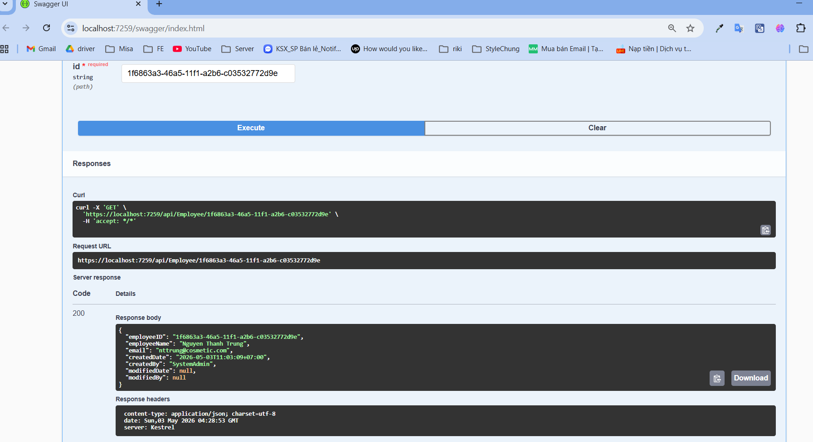

**Quan trọng**
-A:\Wep\Project\Demo_Shop\Cosmetic_App\Cosmetic_App\Program.cs:
+ Để thêm 1 service và repository bất kì đối tượng nào cần 
Add DependentcyInjection vidu:
builder.Services.AddScoped<IEmployeeRepository, EmployeeRepository>();
builder.Services.AddScoped<IEmployeeService, EmployeeService>();

A:\Wep\Project\Demo_Shop\Cosmetic_App\Cosmetic_App\Repository\BaseRepository.cs
trong này chỉ việc đổi string connection để kết nối đến database

**Việc cần làm**
+ Mang các Interface,base để chung từng thư mục theo từng chức năng để dễ kiểm soát
+ Bổ sung các hàm chung: Thêm, cập nhật dữ liệu
+ xử lý đăng nhập đăng kí: phần đăng nhập đăng ký không cần phải dùng base vì + nghiệp vụ không giống nhau chỉ xử dụng các hàm sẵn có là được
+những thao tác giống nhau thêm sửa xóa mới phải dùng base

code này đã call được API và lấy được dữ liệu database

SQL demo: 
-- 1. Tạo Database
CREATE DATABASE IF NOT EXISTS demo_data;
USE demo_data;

-- 2. Tạo bảng Employee
CREATE TABLE IF NOT EXISTS Employee (
    -- Khóa chính (Guid trong C#)
    EmployeeID CHAR(36) NOT NULL, 
    
    -- Các trường riêng của Employee
    EmployeeName NVARCHAR(255) NOT NULL,
    Email VARCHAR(150),
    
    -- Các trường kế thừa từ BaseEntity
    CreatedDate DATETIME(6) NULL,              -- Ánh xạ cho DateTimeOffset?
    CreatedBy NVARCHAR(255) NULL,             -- Khớp MaxLength 255
    ModifiedDate DATETIME(6) NULL,            -- Ánh xạ cho DateTimeOffset?
    ModifiedBy NVARCHAR(255) NULL,            -- Người sửa
    
    -- Thiết lập khóa chính
    PRIMARY KEY (EmployeeID)
) ENGINE=InnoDB DEFAULT CHARSET=utf8mb4 COLLATE=utf8mb4_unicode_ci;

-- 3. Chèn dữ liệu mẫu đúng định dạng
INSERT INTO Employee (
    EmployeeID, 
    EmployeeName, 
    Email, 
    CreatedDate, 
    CreatedBy
) VALUES (
    UUID(), 
    'Nguyen Thanh Trung', 
    'nttrung@cosmetic.com', 
    NOW(), 
    'SystemAdmin'
);